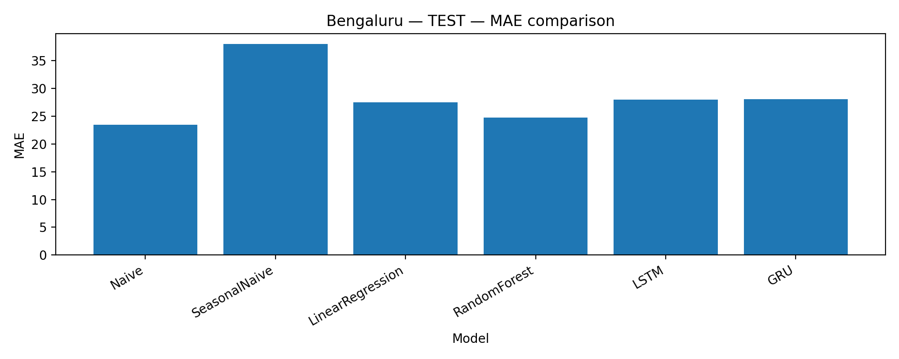
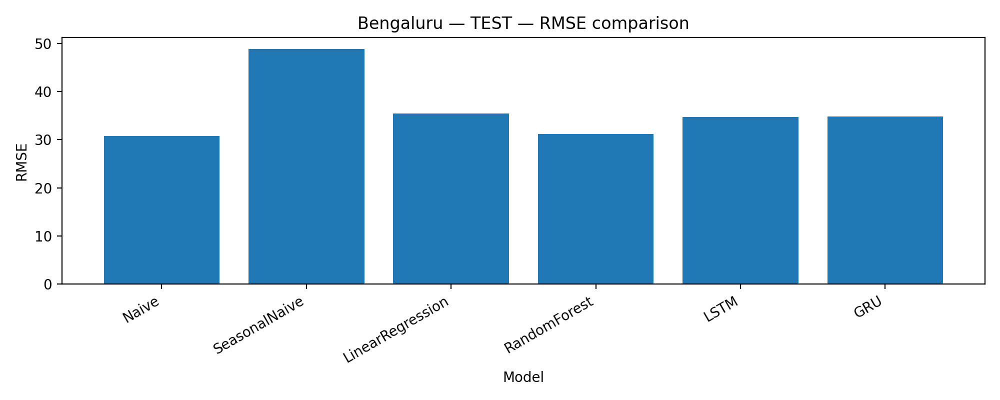
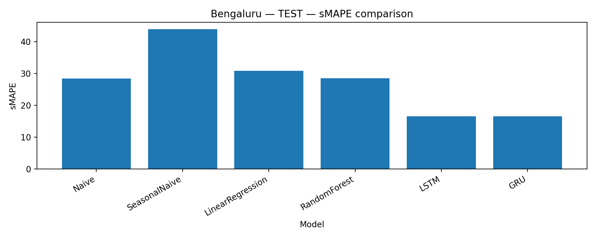
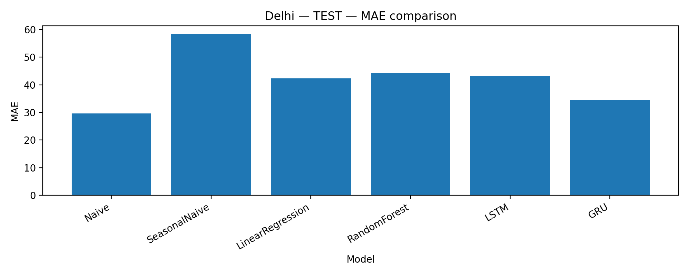
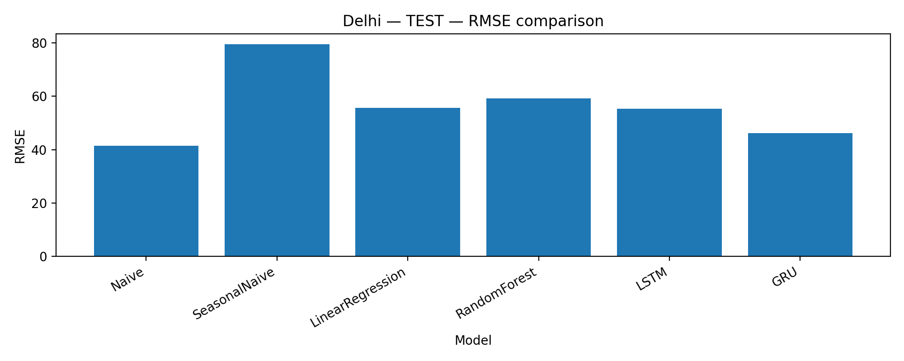
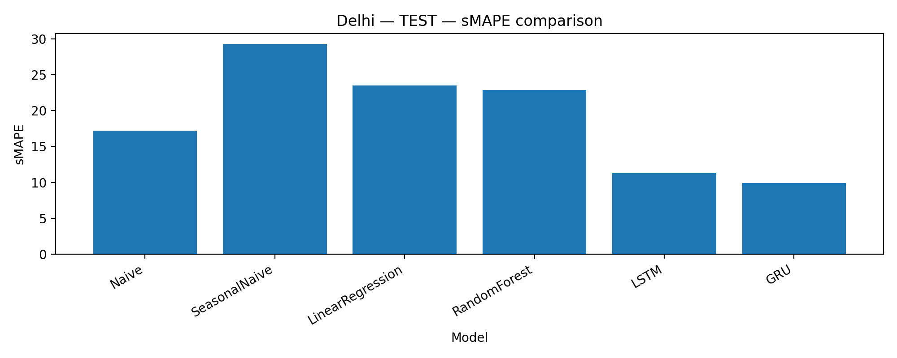
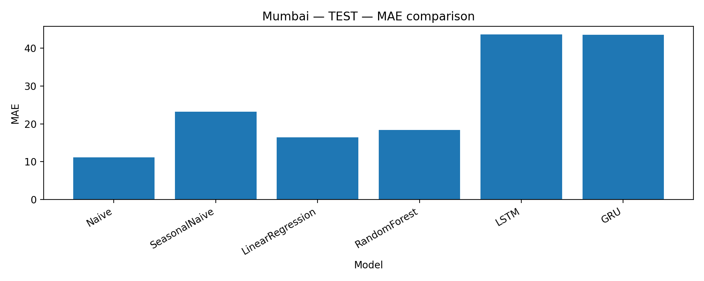
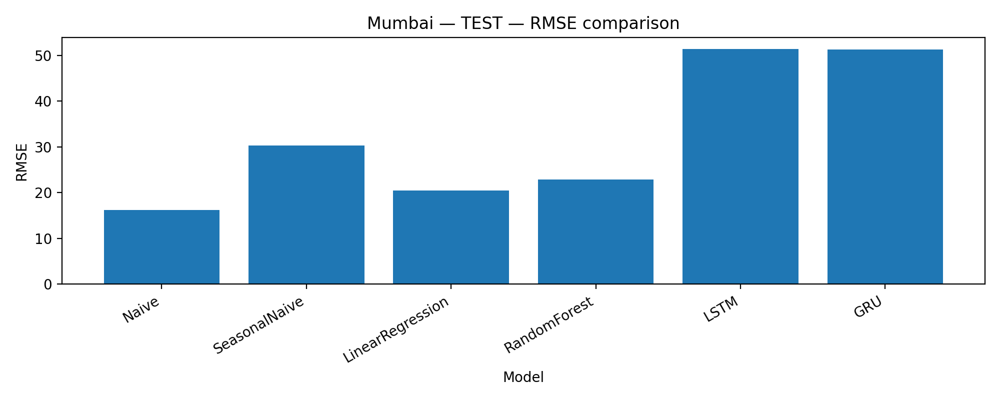
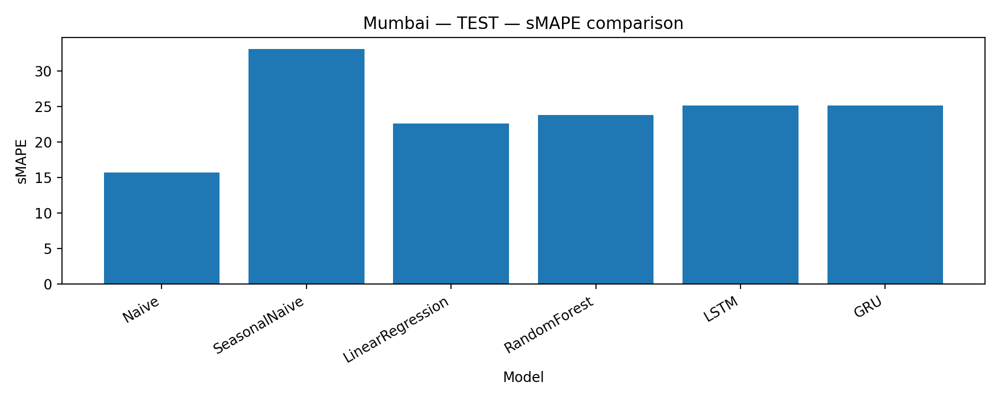

# AQI Forecasting for Indian Cities (Time-Series | ML | Deep Learning)

This project implements an **end-to-end time-series forecasting pipeline** to predict **daily Air Quality Index (AQI)** for major Indian cities using historical pollutant concentration data.

The project compares:
- **Baseline models** (Naïve, Seasonal Naïve)
- **Classical Machine Learning models** (Linear Regression, Random Forest)
- **Deep Learning models** (LSTM, GRU)

The goal is not just prediction, but **methodologically sound comparison and interpretation**.

---

## Cities Covered
- **Delhi**
- **Mumbai**
- **Bengaluru**

---

## Key Objectives
- Compute AQI from pollutant concentrations using **CPCB AQI breakpoints**
- Perform rigorous **time-series EDA and preprocessing**
- Implement and compare **baseline, ML, and DL models**
- Use appropriate **regression metrics** (MAE, RMSE, sMAPE)
- Ensure **reproducibility** and GitHub-ready structure

---

## Data Description
- Daily pollutant concentrations:
  - PM2.5, PM10, NO₂, SO₂, CO, O₃, NH₃
- AQI is **not provided** in the raw data
- AQI is computed by:
  1. Calculating pollutant-wise sub-indices using CPCB breakpoints
  2. Taking the **maximum sub-index** as daily AQI
  3. Capping AQI to the range **[0, 500]**

---

## Train / Validation / Test Split (Time-Series Safe)

Chronological splitting is used to avoid data leakage:

- **Train:** up to 2023-12-31  
- **Validation:** 2024-01-01 to 2024-06-30  
- **Test:** 2024-07-01 to 2024-12-31  

No random shuffling is performed.

---

## Models Implemented

### Baselines
- **Naïve (Persistence):**  
  AQI(t+1) = AQI(t)
- **Seasonal Naïve:**  
  AQI(t+1) = AQI(t−7)

### Classical Machine Learning
- Linear Regression (lag-based features)
- Random Forest (lag-based features)

### Deep Learning
- LSTM (14-day lookback sequences)
- GRU (14-day lookback sequences)

---

## Evaluation Metrics
This is a **regression forecasting problem**, so classification metrics (accuracy, confusion matrix) are **not applicable**.

The following metrics are used:
- **MAE** (Mean Absolute Error)
- **RMSE** (Root Mean Squared Error)
- **sMAPE** (Symmetric Mean Absolute Percentage Error)

---


## Project Goals
- Compute AQI from pollutant measurements using CPCB methodology
- Perform time-series EDA and robust preprocessing
- Train and compare:
  - **Baselines:** Naïve, Seasonal Naïve
  - **Classical ML:** Linear Regression, Random Forest
  - **Deep Learning:** LSTM, GRU
- Evaluate using **MAE, RMSE, sMAPE**
- Provide reproducible, GitHub-ready outputs (results tables, predictions, plots)

---

## Key Takeaways
- **Naïve persistence is extremely strong** for daily AQI forecasting
- More complex ML and DL models **did not consistently outperform baselines**
- Random Forest performed competitively in some cases but was not robust across cities
- LSTM and GRU were successfully implemented but showed **limited generalization**
- This highlights the importance of **strong baselines in time-series forecasting**

---

## Visual Results
All plots are saved in:

## Repository Structure
aqi-forecasting-india-ml-dl/
│
├── data/
│ ├── raw/
│ └── processed/
│
├── notebooks/
│ ├── eda.ipynb
│ ├── preprocessing.ipynb
│ ├── baselines.ipynb
│ ├── ml_models.ipynb
│ ├── dl_lstm_gru.ipynb
│ └── final_comparison.ipynb
│
├── outputs/
│ ├── baseline_results.csv
│ ├── ml_results.csv
│ ├── dl_results_lstm_gru.csv
│ ├── final_model_comparison.csv
│ ├── best_model_by_city.csv
│ ├── ml_test_predictions.csv
│ └── dl_test_predictions_lstm_gru.csv
│
├── reports/
│ └── figures/
│
├── requirements.txt
└── README.md


---

## Data & AQI Computation
The raw dataset contains daily pollutant concentrations. AQI is computed by:
1. Calculating pollutant **sub-indices** using CPCB breakpoint ranges
2. Selecting the **maximum sub-index** as the daily AQI
3. Capping AQI to **[0, 500]**

---

## Final Results (Test Set)
Final model selection is based on **lowest test MAE**.

| City | Best Model (Test) | MAE | RMSE | sMAPE |
|------|-------------------|-----|------|-------|
| Bengaluru | Naïve | 23.47 | 30.79 | 28.43 |
| Delhi | Naïve | 29.66 | 41.43 | 17.24 |
| Mumbai | Naïve | 11.18 | 16.19 | 15.70 |

**Key takeaway:** For daily AQI forecasting, the persistence baseline is extremely strong and was difficult to beat consistently across cities. More complex ML/DL models did not provide reliable improvements on the held-out test period.

---

## Visual Results
Plots are generated in:
`reports/figures/`

Example plots include:
- Model comparison (MAE/RMSE/sMAPE) per city on the test set
- Actual vs predicted (test window) for selected models

## Test-set Model Comparison

### Bengaluru




### Delhi




### Mumbai





---

## How to Run
1. Create and activate a virtual environment  
2. Install requirements:
```bash
pip install -r requirements.txt


Limitations & Future Work

Daily AQI is highly autocorrelated → persistence baselines are very strong

Adding meteorological variables (wind, humidity, temperature) may improve forecasting

Hourly AQI forecasting may reveal stronger temporal patterns for DL models

More advanced DL (attention/transformers) could be explored with larger datasets